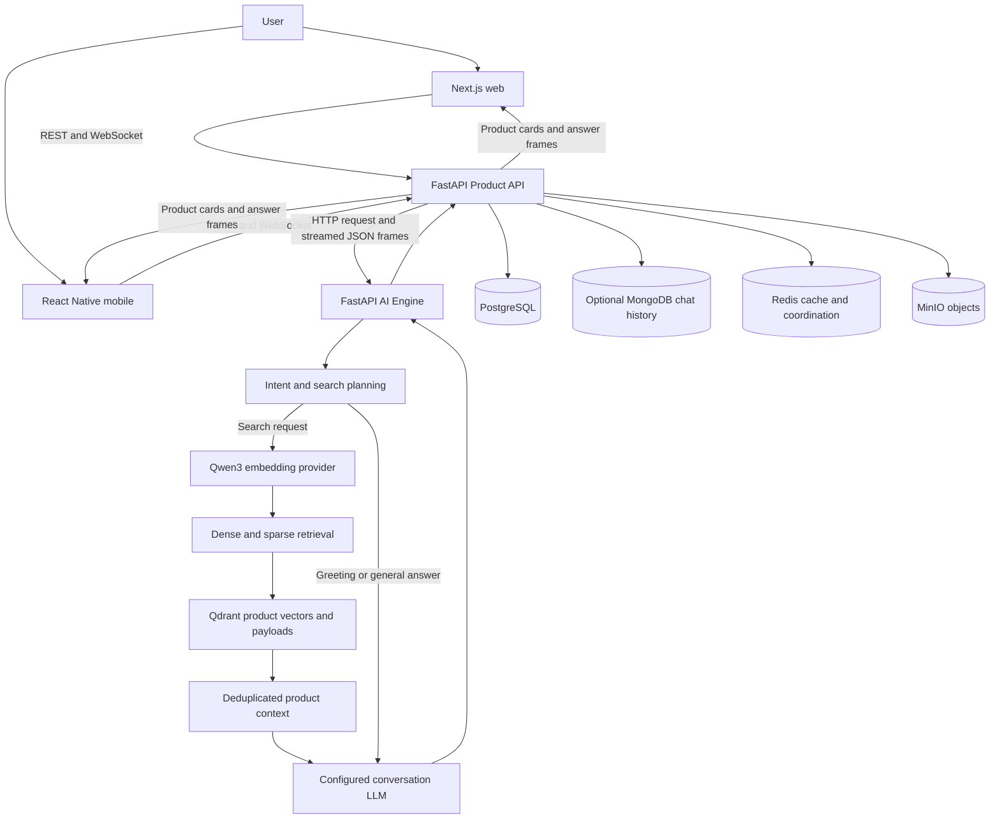
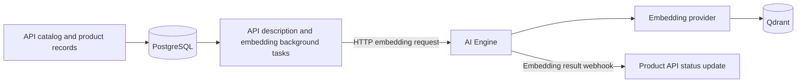

# Architecture

This describes the captured `main` commits listed in [the manifest](snapshot-manifest.json). Paths are relative to this repository. Runtime configuration can override source defaults; production state was not inspected.

## Conversational product discovery

The API does more than proxy requests: `api/app/services/chat_service.py` manages conversation context, message persistence, history windows, and summaries. `api/app/api/v1/ws.py` authenticates sockets and relays frames. `api/app/ai/client.py` calls the AI Engine over HTTP and reads streamed lines.

The AI Engine exposes `text/event-stream` responses, but its `_sse` helper in `ai-engine/app/routers/chat.py` emits newline-delimited JSON rather than standard `data:` SSE framing. The API's custom reader handles that format. Calling it standard browser EventSource SSE without qualification would be inaccurate.

## Search and response construction

1. `ai-engine/app/routers/chat.py` builds context from the system prompt, summary, conversation history, and new query. Intent classification can route greetings/general questions directly to the LLM without retrieval.
2. `_resolve_search` tries the `search_products` tool contract from `app/services/search_tools.py`. Multiple returned tool calls become search specifications. A direct model answer can bypass search.
3. If tools fail or are unavailable, the structured parser rewrites the query and returns filters. If parsing fails, the raw query is retained. A rewritten query can be paired with a raw-query search to retain terms omitted in rewriting.
4. Filter normalization and color injection produce payload constraints; `augment_query_text` includes useful filter values in the embedding text while skipping size-only values.
5. The embedding provider produces a dense vector. `RAGService` queries Qdrant, optionally combining dense and sparse candidates. Retrieved product payloads are formatted into context for the conversation LLM.
6. Responses include product cards and generated text. Empty retrieval has a localized no-results response. Model/embedding failures have explicit failure paths. Stream failure can fall back to a non-streaming LLM call.

## Retrieval implementation

`ai-engine/app/services/rag.py` defines cosine dense vectors and the named sparse vector `text_bm25`. Sparse features use normalized English/Arabic tokenization, stemming, hashed term IDs, and term counts with optional product-name boosting. Qdrant's `Modifier.IDF` supplies corpus weighting. This is **BM25-style TF/IDF sparse retrieval**, not a verified full BM25 implementation with length normalization and saturation.

Hybrid queries prefetch dense and sparse candidates, apply payload filters to both, and use `FusionQuery` with `Fusion.RRF` as the default. Fusion strategy and candidate-pool sizes are instance parameters. The code delegates RRF scoring to Qdrant; it does not pass a custom RRF constant. Dense-only retrieval applies when hybrid prerequisites are absent. A hybrid request exception returns an empty result, **not an automatic retry as dense-only**.

Search first applies all supplied filters. If too few products remain, it can relax to color-only and then unfiltered candidates; size overlap can boost fallback candidates. These are relevance preferences rather than guaranteed hard constraints for every returned item. Results deduplicate by product ID, including locale-aware handling of multiple points and merges across search specifications. Similar-product search also excludes the reference product.

## Catalog ingestion and storage

`api/app/services/embedding_cron.py` builds product embedding payloads, coordinates recovery work with a Redis lock, and constructs result callbacks. `ai-engine/app/routers/embed.py` and `app/services/rag.py` implement embedding/upsert work. PostgreSQL also stores model settings and encrypted model keys; the AI Engine's key service reads the relevant configuration. Actual keys and runtime state are excluded.

MongoDB is optional and holds conversations/messages (`api/app/db/mongo.py`). Without it, chat features can return service-unavailable while other API functions remain available. MinIO stores uploaded and cached image objects. Redis supports caches, rate limiting, and coordination. These roles are visible in the source; no data dumps are included.

## Supporting infrastructure

`infra/stacks/` contains sanitized Docker Swarm/Compose definitions for application services, PostgreSQL, Redis, RabbitMQ, MinIO, Qdrant, Caddy, monitoring, and administration tools. `infra/ansible/playbook.yml` and scripts show host/bootstrap and stack deployment mechanics; external secret references remain placeholders/configuration contracts.

RabbitMQ setup in `api/app/core/broker.py` uses a robust connection, durable `search_requests` and `web_scrape_jobs` queues, and persistent message publication support. No application call sites invoking `publish_event` or a queue consumer were found in the captured API. RabbitMQ is therefore documented as supporting broker setup, not as the implemented synchronous chat or embedding transport.
